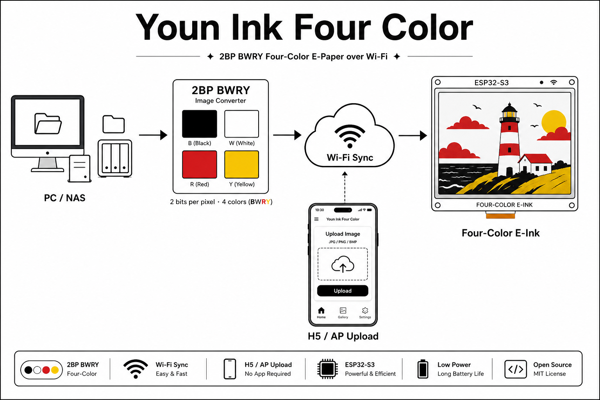

# Slowglass

Firmware for a slow-refresh, four-color e-paper dashboard — a quiet pane of
glass that shows you the day: weather, your meeting room's schedule, a
calendar, a photo. Named after Bob Shaw's *slow glass*, the sci-fi material
light takes years to pass through, so that looking at it means looking into
another time and place.

Runs on the ZecTrix ESP32-S3 4.2" e-paper devkit (400×300 BWRY panel —
black, white, red, yellow — SSD2683 driver), rendering straight to a raw
framebuffer with no LVGL.

## Widgets

The firmware is a **widget platform**: each feature lives in its own
directory under `firmware/main/widgets/` and plugs into the system through a
small registry. You choose which widgets a build contains.

| Widget | What it shows |
| --- | --- |
| `weather` | Full-bleed MET Norway forecast dashboard + hourly detail page |
| `makeplans` | Door sign for a [MakePlans](https://www.makeplans.com) room: today's bookings, occupancy, NFC booking tag |
| `calendar` | Monthly calendar grid |
| `news` | News page |
| `almanac` | Almanac page |
| `lifebar` | Life-progress bar |
| `yearprogress` | Year progress |
| `ebook` | Plain-text ebook reader |

Core pages (always built in): photo gallery + AP image transfer, settings,
WiFi status, chat, log.

### Pick widgets at flash time

`idf.py menuconfig` → *Xiaozhi Assistant → Widgets* — one checkbox per
widget. A disabled widget's code, pages, HTTP endpoints, data source, and
battery wakeups drop out of the image entirely. For a single-purpose device
there are preset files, e.g. a door-sign-only image:

```bash
idf.py -B build_doorsign -DSDKCONFIG=sdkconfig.doorsign \
  -DSDKCONFIG_DEFAULTS="sdkconfig.defaults;sdkconfig.defaults.esp32s3;sdkconfig.defaults.doorsign" build
```

### Write your own

A widget is one directory: a renderer drawing into the 1bpp framebuffer, an
optional data fetcher, optional HTTP endpoints, and a `WidgetDef` that ties
them together. Widgets never include board or application headers
(`firmware/scripts/check_widget_deps.sh` enforces it), so they can be moved
to other firmwares by copying the directory.

- [docs/adding-a-widget.md](docs/adding-a-widget.md) — the checklist
- [docs/porting-a-widget.md](docs/porting-a-widget.md) — taking a widget elsewhere

## Getting started

Requires [ESP-IDF](https://docs.espressif.com/projects/esp-idf/) ≥ 6.0 with
the ESP32-S3 toolchain.

```bash
cd firmware
source $IDF_PATH/export.sh
idf.py build
idf.py -p /dev/ttyACM0 flash   # your serial port may differ
```

First boot opens a WiFi setup hotspot (captive portal at `192.168.4.1`).
After connecting, the device fetches data on its own schedule; on USB power
it also starts a LAN web server for configuration.

### Device web UI (LAN, USB power)

| URL | Purpose |
| --- | --- |
| `/` | Photo upload and gallery management |
| `/weather` | Weather location override (lat/lon/city — IP geolocation is wrong behind a VPN) |
| `/makeplans` | Door-sign pairing with a MakePlans room display code |
| `/api/pages` | GET/POST home page, enabled pages, data-source intervals |
| `/api/weather`, `/api/makeplans` | The JSON APIs behind the pages above |

Which page the device boots into is runtime config, not a build:
`curl -X POST http://<device>/api/pages -d '{"home":"doorsign"}'`.

### Buttons

- **UP double-click** — quick-switch menu between enabled pages
- **DOWN long-press** — settings; **UP long-press** — leave settings
- **BOOT long-press** on gallery — AP image-transfer mode
- **UP+DOWN long-press** — WiFi setup hotspot

### Power

On battery the device duty-cycles: a short awake window to fetch and
redraw, then deep sleep. The wake interval is the fastest cadence any
enabled data source needs, and widgets can shorten it — the door sign wakes
exactly at booking boundaries so the panel flips on time.

## The 2BP four-color image pipeline



Gallery images are converted (Floyd–Steinberg dithered) to 2-bit BWRY and
pushed over WiFi, either from the device's own AP-mode web page or from the
optional Python backend under `server/` (voice assistant, TTS, todo sync,
image push, OTA — inherited from upstream; see its scripts for details).
A 1bpp black/white panel variant remains selectable in Kconfig
(`ZECTRIX_EPD_PANEL_1BPP`).

## Credits

- Forked from
  [LazyYoun/youn-ink-fourcolor-firmware](https://github.com/LazyYoun/youn-ink-fourcolor-firmware),
  which grew out of the [xiaozhi](https://github.com/78/xiaozhi-esp32)
  ESP32 assistant ecosystem. The gallery, chat/voice pipeline, AP transfer,
  and panel drivers come from that lineage.
- **Weather data from [MET Norway](https://api.met.no/)** (CC BY 4.0). If
  you deploy this firmware, set your own contact in the User-Agent in
  `firmware/main/widgets/weather/weather_api.cc` per their
  [Terms of Service](https://api.met.no/doc/TermsOfService).
- Door-sign schedule via the
  [MakePlans room display API](https://developer.makeplans.com/guide/room-display/).

Licensed under the [MIT License](LICENSE).
